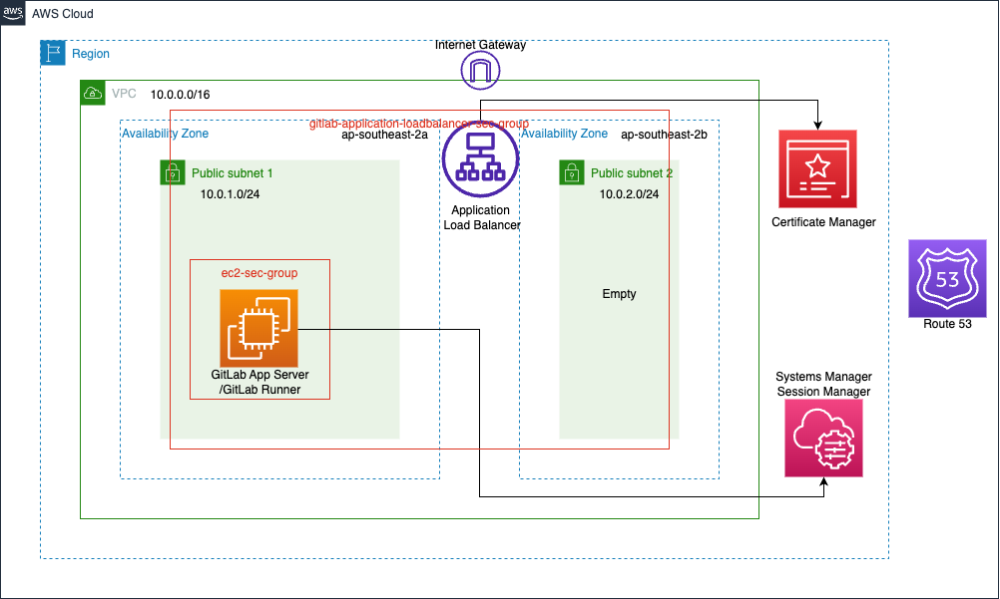

# Overview

This Cloud Formation Template provisions resources for a gitlab instance.

The current state architecture diagram can be found below.



## Requiements

### AMI
This Template deploys an ec2 with a AMI supplied as a parameter.

### Hosted Zone 
This Template needs a hosted zone deployed in the same account.

### Certificate
We need to include the arn of the certificate we will use in the parameters section of the template.

This Certificate will be assigned to the ALB Listener 

Most likely we will need to create a certificate for that.

#### Creating a certificate with an already existing hosted Zone
1. Check that you have a hosted zone (e.g example.com)
2. Create certificate for a sub-domain (gitlab.example.com) using ACM's "Request Certificate" feature.
3. Once the certificate is issued CNAME records will need to be created in hosted zone Route 53. 
To do this click on the newly created certificate and click "create records in route 53". Then follow the prompts to create these records.
4. Create an Alias record for the sub-domain(gitlab.example.com) in Route 53 that routes to the application load balancer

## GitLab post-deployment setup
After deploying the cloudformation stack the gitlab software should be installed(comes with the ami) along with docker and gitlab-runner(installed via user data script).

## logging into the session manager console
Use Session Manager to ssh into the instance then run `sudo su` for root access.

## configure the external url
We need to edit the file `/etc/gitlab/gitlab.rb` and change the value of the external url to be the domain name that we use for our instance([docs](https://docs.gitlab.com/omnibus/settings/configuration.html#configure-the-external-url-for-gitlab)).

```c
## /etc/gitlab/gitlab.rb
external_url "http://gitlab.example.com"
```

Once editing the file reconfigure/restart the gitlab-ctl

```
$ sudo su
root@ip-10-x-x-x:/# cd /
root@ip-10-x-x-x:/# gitlab-ctl reconfigure
root@ip-10-x-x-x:/# gitlab-ctl restart
```

### Register the gitlab runner

```sh
sudo gitlab-runner register
```
